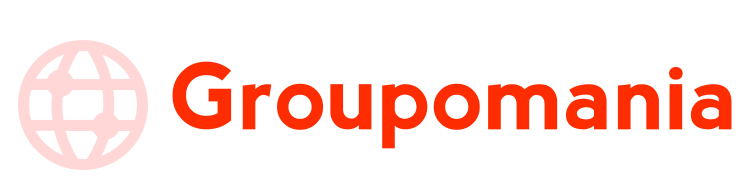

# Créez un réseau social d’entreprise

## Groupomania

---

### **Scénario**

> Vous êtes développeur depuis plus d'un an chez CONNECT-E, une petite agence web regroupant une douzaine d'employés.
> Le projet consiste à construire un réseau social interne pour les employés de Groupomania. Le but de cet outil est de faciliter les interactions entre collègues. Le département RH de Groupomania a imaginé plusieurs fonctionnalités pour favoriser les échanges entre collègues.

### Les exigences du projet

- respecter l’identité graphique fournie dans le brief
- La presentation des fonctionnalités doit etre simple
- Une page de connexion et creation de compte doit être simple
- la création d’un compte doit être simple (mail et mot de passe)
- la la persistance pendant toute sa connexion , ainsi que deconnexion du compte doit être possible
- Les données de connexion doivent être sécurisées.
- la création , modification et suppression d'un post(doit pouvoir contenir texte et image)
- un systeme de like et dislike doit etre présent
- Création d'un role administrateur

---

### Technologies utilisées

- Node
- Express
- MongoDb
- React
